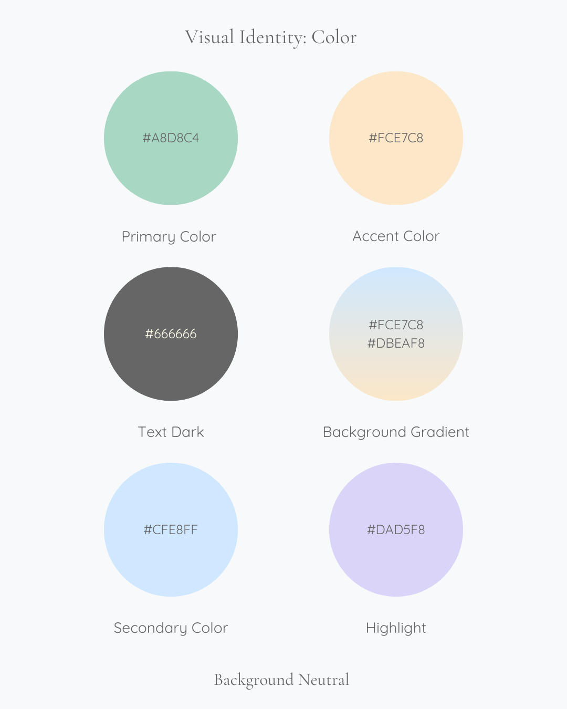
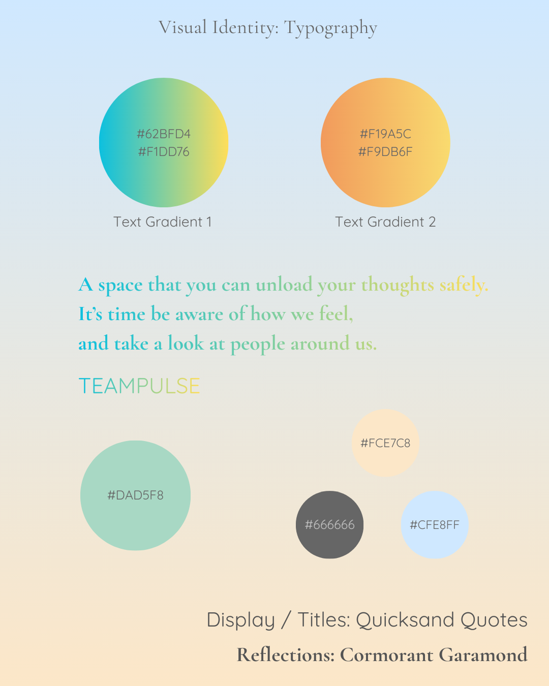

# TeamPulse Frontend

Teampulse is a wellbeing intelligence platform designed to help teams surface emotional trends early, support psychological safety, and make healthier workload decisions. 

## Table of Content

  - [Design Decisions](#design-decisions)
  - [Key Features](#key-features)
  - [Experience \& Interface](#experience--interface)
  - [Visual Language](#visual-language)
  - [Tech Stack](#tech-stack)
  - [Project Structure](#project-structure)
  - [Technical Implementation](#technical-implementation)
  - [Get Started](#get-started)
  - [Tradeoffs \& Future Improvements](#tradeoffs--future-improvements)
  - [Project Origin](#project-origin)
  - [Contributors](#contributors)


##  Design Decisions

**Designing for Psychological Safety**  
Because mood and workload are sensitive topics, the interface was intentionally crafted to reduce emotional friction through supportive language, calm visuals, and low-cognitive-load interactions — encouraging honesty without creating pressure.

**Gamification Without Competition**  
Instead of leaderboards, TeamPulse reinforces intrinsic motivation through personal streaks and garden growth. The focus is consistency, not comparison — aligning engagement mechanics with the app’s wellbeing goals.

**Scoped Visibility for Managers**  
Managers have access to detailed check-in data for members within their own teams, enabling meaningful insight while preserving organizational boundaries. Team-level scoping ensures that sensitive wellbeing information remains contextually relevant and is not exposed across unrelated groups.

**Reducing Cognitive Load**  
Check-ins are designed to be quick and repeatable. Clear interaction patterns and digestible visualizations help users complete tasks effortlessly while enabling managers to recognize patterns at a glance.

**Supporting Behavioral Change — Not Just Measurement**  
Rather than functioning purely as a tracking tool, TeamPulse encourages reflective habits through weekly rituals and subtle reinforcement, helping teams move from awareness toward healthier working dynamics.


##  Key Features

- **Weekly Check-ins** — Employees log mood and workload in a lightweight, repeatable flow  
- **Manager Intelligence Dashboard** — Surface team trends, distribution patterns, and early risk signals  
- **Personal Wellness Dashboard** — Individual insights including history, streaks, and reflections  
- **Trend Visualization** — 4-week comparisons to help teams understand directional change  
- **Needs Attention Alerts** — Highlight potential wellbeing risks for proactive support  
- **Gamified Engagement** — Points, streaks, and garden progression encourage consistent participation  
- **Role-Based Access Control** — Distinct manager and team member experiences  
- **Secure Authentication** — Token-based login and protected routes  
- **Responsive Interface** — Designed for clarity across desktop and mobile


##  Experience & Interface

- **Calm Visual Language** — A soft palette and breathing-inspired motion create a focused, low-friction check-in experience  
- **Clarity-First Dashboards** — Data visualizations prioritize readability so managers can interpret trends within seconds  
- **Attention-Aware Signals** — Severity color-coding helps important insights stand out without overwhelming the interface  
- **Garden Progression System** — Visual rewards transform engagement into a sense of growth rather than obligation  
- **Reflective Micro-Interactions** — Quotes and progress cues reinforce the app’s wellbeing-first tone

## Visual Language
TeamPulse was visually designed to feel calm, reflective, and psychologically safe — positioning check-ins as a supportive pause rather than another operational task.

Color, typography, and motion were intentionally selected to reduce cognitive load and create emotional softness within a data-driven environment.

### Color System

Muted, low-saturation tones help minimize visual stress while reinforcing the product’s wellbeing focus.

### Typography

A pairing of expressive display type and highly legible body text supports both emotional resonance and fast dashboard readability.


<p align="center">
  
  
</p>


## Tech Stack

**Frontend Framework & Build**
- React 19.2.0 - UI library
- Vite 7.2.2 - Fast build tool and dev server
- React Router DOM 7.9.6 - Client-side routing

**Data Visualization**
- Recharts 3.5.0 - Interactive charts and graphs
- Chart.js 4.5.1 - Additional charting capabilities
- React-ChartJS-2 5.3.1 - React bindings for Chart.js

**UI & Animation**
- Framer Motion 12.23.24 - Smooth animations and transitions
- FontAwesome 7.1.0 - Icon library
- Lucide React 0.556.0 - Modern icon set

**HTTP & State Management**
- Axios 1.13.2 - API client for HTTP requests
- React Hooks - Built-in state management


**Developer Tools**
- ESLint 9.39.1 - Code linting
- Vite plugin React - Fast refresh for development

## Project Structure

```
src/
├── api/                 # API endpoint functions
│   ├── get-checkins-by-week.js
│   ├── get-moods.js
│   ├── get-teams.js
│   ├── get-user-by-id.js
│   ├── get-workloads.js
│   ├── post-createcheckin.js
│   └── post-signup.js
├── components/          # Reusable React components
│   ├── AllCheckinView.jsx     # View all check-ins
│   ├── AuthProvider.jsx       # Authentication context
│   ├── ButtonComponent.jsx    # Reusable button
│   ├── CardIcon.jsx
│   ├── CheckInForm.jsx        # Check-in submission form
│   ├── DashboardButton.jsx    # Dashboard navigation
│   ├── DashboardCard.jsx      # Dashboard card display
│   ├── DashboardView.jsx      # Manager dashboard view
│   ├── LandingAnimation.jsx   # Landing page animations
│   ├── Loader.jsx             # Loading spinner
│   ├── LoginForm.jsx          # Login form
│   ├── Logo.jsx               # Logo component
│   ├── Logout.jsx
│   ├── ManagerOnly.jsx        # Manager access guard
│   ├── NavBar.jsx             # Navigation bar
│   ├── NeedsAttention.jsx     # Alert component
│   ├── PieChart.jsx           # Pie chart visualization
│   ├── WeeklyComparison.jsx   # Weekly trend charts
│   └── user/                  # User-specific components
│       ├── UserCheckins.jsx       # User check-in history
│       ├── UserDashboard.jsx      # User dashboard
│       ├── UserQuote.jsx
│       ├── UserStats.jsx
│       └── UserWeeklyComparison.jsx
├── pages/               # Page components
│   ├── 404Page.jsx
│   ├── CheckInPage.jsx        # Check-in form page
│   ├── HomePage.jsx           # Landing page
│   ├── LoginPage.jsx
│   ├── ManagerDashboardPage.jsx
│   ├── PermissionDeniedPage.jsx
│   ├── SignupPage.jsx
│   └── UserDashboardPage.jsx
├── hooks/               # Custom React hooks
│   ├── use-auth.js
│   ├── use-checkins.js
│   ├── use-moods.js
│   ├── use-teams.js
│   ├── use-user.js
│   └── use-workloads.js
├── data/                # Mock data for development
│   ├── mockForTeamMood.js
│   ├── mockForTeamWorkflow.js
│   ├── mockPulseLogs.js
│   └── mockTeams.js
├── styles/              # Global styles
│   └── global.css
├── assets/              # Static assets
├── main.jsx             # Application entry point
└── App.jsx              # Root component

public/
└── _redirects           # Netlify routing configuration
```

## Technical Implementation
TeamPulse was built with a focus on clarity, modularity, and maintainable data flow.  
The frontend architecture emphasizes reusable components, predictable state patterns, and separation of concerns to support future scalability.

### Authentication & Authorization

Authentication is handled through token-based flows, with session state managed via a centralized `AuthProvider`. Protected routes ensure that only authenticated users can access application features.

Authorization is role-driven:

- **Team Members** can submit check-ins and view personal insights  
- **Managers** have elevated visibility into team-level data  

This structure keeps permission logic explicit while maintaining a predictable user experience.

### Data Flow

The application follows a unidirectional data flow:

1. User interactions trigger API requests via dedicated service modules  
2. Custom hooks handle data fetching and normalization  
3. State updates propagate through the component tree  
4. Visualizations render derived insights for immediate interpretation  

This approach reduces side effects and keeps data behavior predictable across the interface.

### Component Architecture

Components are structured around reuse and composability. Shared UI elements (cards, charts, navigation) act as building blocks across dashboards, while feature-specific components encapsulate localized behavior.

This balance helps prevent duplication while keeping the codebase approachable for future contributors.


## Get Started

### Prerequisites

- Node.js 16+ 
- npm or yarn package manager

### Installation

1. Clone the repository:
```bash
git clone <repository-url>
cd teampulse-frontend
```

2. Install dependencies:
```bash
npm install
```

3. Configure environment variables (if needed for API endpoints):
```bash
# Create a .env file with your backend API URL
VITE_API_URL=http://localhost:8000
```

### Development

Start the development server with hot module replacement:
```bash
npm run dev
```

The application will open at `http://localhost:5173`

### Build for Production

Create an optimized production build:
```bash
npm run build
```

Build artifacts will be in the `dist/` directory.

### Preview Production Build

Preview the production build locally:
```bash
npm run preview
```

### Linting

Run ESLint to check code quality:
```bash
npm run lint
```


Ensure the backend server is running before testing API functionality.


##  Tradeoffs & Future Improvements

Like most evolving products, TeamPulse reflects a series of intentional tradeoffs made to prioritize clarity, usability, and delivery momentum.

**Speed vs. Architectural Complexity**  
The project favors readable, approachable patterns over premature abstraction. While additional layers (such as global state libraries or heavier architectural patterns) could support future scale, the current structure keeps the codebase accessible and easy to iterate on.

**Insight vs. Data Sensitivity**  
Providing managers with meaningful wellbeing insights required balancing visibility with appropriate data boundaries. The current team-scoped model ensures relevance while leaving room to explore more advanced privacy patterns — such as anonymized aggregation — as the product matures.

**Engagement vs. Emotional Pressure**  
Gamification was intentionally designed to encourage consistency without introducing competition. Choosing streak-based reinforcement over leaderboards supports the app’s wellbeing goals, though future iterations could explore more adaptive motivation systems tailored to individual preferences.

**Feature Depth vs. Cognitive Load**  
Dashboards prioritize immediate interpretability rather than dense analytics. This improves usability but leaves space for deeper trend intelligence as user needs become clearer.

**Rapid Iteration vs. Type Safety**  
The project is currently implemented in JavaScript to enable fast development cycles. Migrating toward TypeScript is a natural next step to strengthen reliability as the system grows.


## Project Origin

TeamPulse was initially developed as a collaborative full-stack application as part of the SheCodes program, built alongside a cross-functional team covering both frontend and backend development.

This repository represents my continued evolution of the frontend — where I have independently refined the user experience, strengthened visual design, and expanded key interaction patterns to further explore human-centred wellbeing tools.

Original team repository:
👉 https://github.com/SheCodesAus/full-stack-frogs_frontend/tree/main/teampulse-frontend


## Contributors

Font-end:

- Sara Liang — leungyunyee@gmail.com — https://au.linkedin.com/in/sara-liang-au

- Blossom (Eliza) Herbison - eliza.herbison94@gmail.com - www.linkedin.com/in/eliza-herbison-102954169

- Joyce Gonzaga 

Back-end:

- Sheila Sukmadja 
- Trang Vo 
